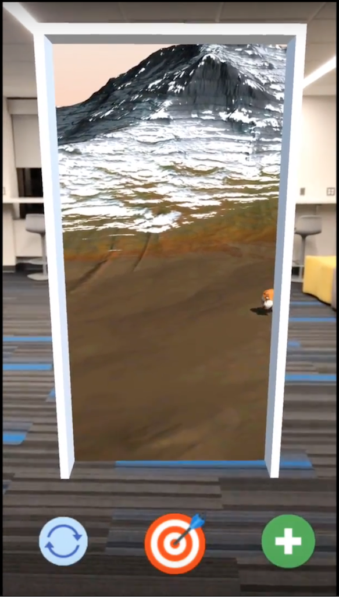

# Goal Tracking with AR

Let's bring your goals to life. This hack aims at leveraging augmented reality to make the process of setting up and tracking your financial goals engaging, exciting and fun.

Watching numbers change is boring. Understanding charts can be complicated. We think it can be done better with augmented reality. Imagine you're saving for a new home. As your contributions grow, see your home grow in augmented reality!

### Video

### Required software

1. Xcode 9
2. Unity 2017.1.1f1
3. iOS 11
4. Unity ARKit Plugin 1.0.10

[Portal blog post](https://tomhulton.blogspot.co.uk/2015/08/portal-rendering-with-offscreen-render.html)

[Unity Particle Pack](https://www.assetstore.unity3d.com/en/#!/content/73777)

[Unity ARKit Remote demo](https://forum.unity.com/threads/arkit-support-for-ios-via-unity-arkit-plugin.474385/page-13#post-3153415)

### Build notes

1. File -> Build Settings
2. Switch to iOS
3. Player Settings (change Xcode project settings if needed)
4. Create Xcode project, replace old Xcode project on newer builds